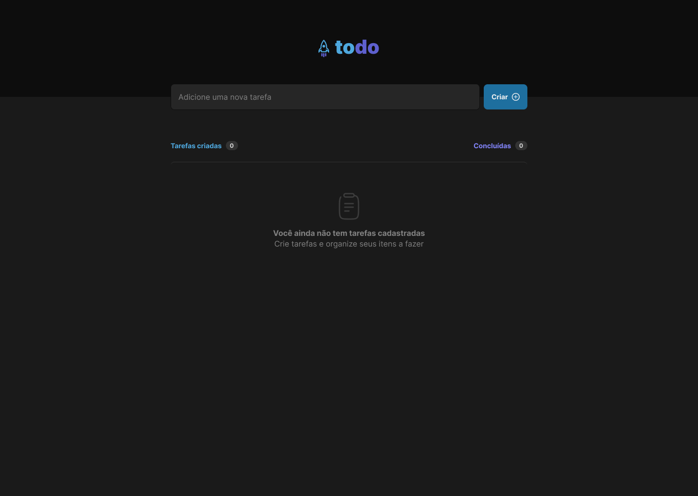

# TO-DO-LIST

The To-Do List is a web application designed to help users create, manage, and track their tasks efficiently. With an intuitive interface, users can add new tasks, mark them as completed, and organize their daily activities.

## 🚀 Technologies :

**Front-end:** HTML5, CSS3 and JAVASCRIPT;

## 👩‍💻 Functionalities:

- Add tasks;
- Remove tasks;
- Mark task as completed;

## 💻 How to use :

Project Link : https://project-to-do-list-new.vercel.app/

## 👨 Author :

[@jhonathanSousa](https://www.linkedin.com/in/jhonathan-alves-sousa/)
